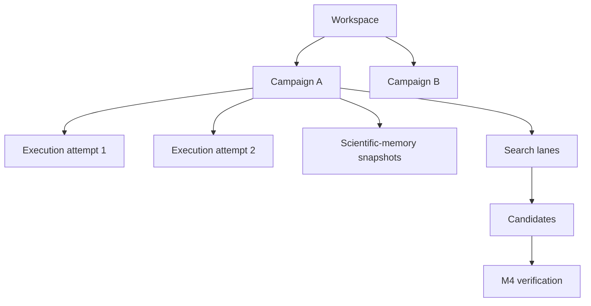

# HEG Documentation

Structural Graph Conjecture Lab documentation is organized by audience rather
than implementation chronology.

## Choose your path

| Goal | Documentation |
|---|---|
| Run a campaign | [User guide](user/README.md) |
| Resume a stopped or failed campaign | [Resume guide](user/resume.md) |
| Operate the dashboard and runtime | [Operator guide](operator/README.md) |
| Understand the system | [Architecture](architecture/README.md) |
| Look up commands, states, or actions | [Reference](reference/README.md) |
| Modify the repository with Codex | [Codex development guide](codex/README.md) |
| Understand architectural decisions | [Architecture Decision Records](adr/README.md) |
| Review implementation evidence | [Evidence reports](reports/README.md) |
| See the current production snapshot | [Current Status](CURRENT_STATUS.md) |
| See historical completion evidence | [Implementation Status](IMPLEMENTATION_STATUS.md) |

> [!IMPORTANT]
> Evidence reports describe what a particular gate proved at a particular
> commit. They are not the primary operating manual. Use the user, operator,
> architecture, and reference documents for current behavior.

## Core mental model

A workspace is an isolated research environment. A campaign is one scientific
experiment. Resume creates another execution attempt under the same campaign;
it does not create a new scientific experiment.

## Documentation conventions

- Commands are shown in copyable code blocks.
- GitHub callouts distinguish notes, warnings, and safety boundaries.
- Mermaid diagrams render directly on GitHub.
- Raw protocol details are kept in reference and architecture pages.
- User pages contain intentional screenshot markers for automated capture.
- Current evidence and historical reports remain under `docs/reports/`.
