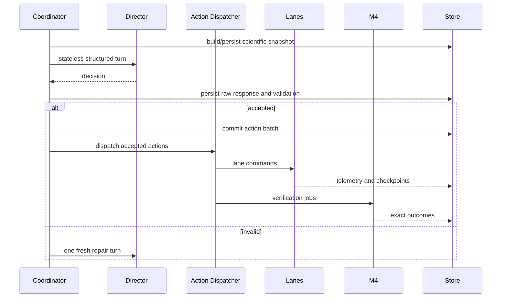

# Campaign Runtime

## Preparation boundary

Preparation creates a durable campaign row and exact plan before:

- credential access;
- App Server runtime;
- model turn;
- lane/action/search execution.

The plan fingerprint binds the scientific and runtime contract.

The operator shortcut `sglab experiment run --config experiment.toml` uses a
single persistent `[experiment].id`. It atomically creates or validates the
non-synthetic first-real-graph workspace marker, prepares the plan, imports
only the explicitly authorized Codex `auth.json`, revalidates the fingerprint,
and starts or resumes the matching campaign. A marker-less workspace is
upgraded only when it is empty; populated or incompatible workspaces fail
closed. The lower-level `init --kind first-real-graph-campaign` and
`research-campaign prepare` paths use the same marker rules.

The plan also binds `director_mode`. `llm` remains the default; `passive`
selects the versioned `balanced_v1` host scheduler and its seed. Both reviewed
contracts remain in the plan so a later execution attempt may explicitly
select either mode without rewriting campaign history.

The optional `proposal_ranking` plan field is either `null` (the default) or
the reviewed catalog ID `mutation_forge_stage4r_v1`. It is authorized only by
the LLM-Director prepare/start CLI or dashboard allowlist, is included in the
plan fingerprint, and is inherited unchanged by every attempt. Passive mode
does not activate this option and retains its existing behavior. Director
validation uses the same plan-bound capability and rejects an omitted,
changed, random-restart, or patch-supplied ranking field.

## Start

Start performs:

1. plan reload and fingerprint recomputation;
2. exact authorization check;
3. private runtime preparation;
4. App Server compliance/isolation gates;
5. execution-attempt creation;
6. campaign deadline activation;
7. Director cycle.

## Execution attempts

The first start and every Resume create immutable attempts under one campaign.

An attempt owns process-level resources and provenance. The campaign owns
scientific continuity.

Every attempt records its active mode, previous mode, transition record, and a
mode-specific contract fingerprint. A mode change is accepted only while
creating a new attempt; an active attempt never falls back automatically.

## Live loop

In `passive` mode the Director participant is replaced by the deterministic
host scheduler. The coordinator starts no App Server and creates no private
Codex home, model session, repair turn, or token record. It restores persisted
scheduler state and reviews at evaluation-count boundaries plus critical
integrity events. Wall-clock time still enforces the campaign deadline, but is
not a scientific scheduling input.

The coordinator drains lane events before publishing a due passive snapshot.
After publication, the local deterministic review and its action-batch commit
run without pumping or dispatching more lane events between them. This keeps
ordinary queued lane progress from invalidating the snapshot that the
coordinator just created while preserving the commit-time campaign-version
check.

If another durable writer nevertheless advances the campaign version across
that boundary, the stale batch is persisted and dispatches nothing. The
coordinator publishes one fresh snapshot and performs one fresh deterministic
scheduler review. A second `rejected_stale_campaign`, or any other rejected
passive batch, stops fail-closed.

## Fault semantics

Infrastructure, protocol, resource, authentication, and verifier-integrity
faults stop fail-closed.

Scientific/model-output validation faults:

- preserve invalid response;
- persist the bounded validation paths and messages for the initial and repair
  turns;
- execute nothing;
- optionally perform one bounded fresh replan;
- stop cleanly after a second invalid result.

The status projection exposes those diagnostics alongside each Director turn,
so an operator can distinguish an empty/stale action-space contract from a
malformed action without editing the campaign database or artifacts.

## Resume

Resume supports terminal/recovery states without resetting cumulative state.
It:

- creates a new attempt;
- reconstructs memory/checkpoints;
- excludes terminal actions/jobs;
- records resource changes;
- records repair acknowledgement;
- never silently changes the scientific contract.

The high-level `sglab experiment run` shortcut treats selecting the same
experiment ID after a `paused_fault` as the operator's recovery request only
when the current repository commit differs from the failed attempt. It passes
an explicit recorded acknowledgement to the lower-level Resume boundary. If
the fault was produced by the current code, the shortcut refuses to retry;
the operator must repair the code first or use the explicit Resume workflow.

Checkpoint references remain immutable history even when their artifact is no
longer available. Before and during recovery, only the latest integrity-
checked checkpoint for each active lane loaded into the current lane manager
is exposed as an executable target. A retained candidate checkpoint is added
only when it is an explicit current target; other older checkpoints remain
evidence. A missing historical artifact therefore cannot be pinned or selected
by a new Director cycle. The complete bounded executable checkpoint set for
one cycle is pinned atomically, so retention eviction cannot remove a target
that the same cycle has not pinned yet.

Terminal attempt cleanup drains final lane events, reaps lane processes, and
closes the manager-owned multiprocessing queues before the runner returns.
This lets the dashboard's detached campaign child exit instead of leaving a
terminal attempt as a live process.

## Control operations

- pause/continue affect a live attempt;
- stop ends the attempt;
- Resume creates a new attempt.

## Deadlines

The campaign wall budget is tracked across the current authorized attempt
contract. An additional Resume budget extends execution without erasing
previous elapsed time or results.
