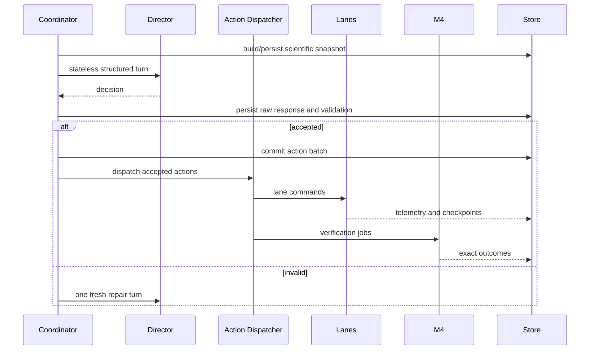

# Campaign Runtime

## Preparation boundary

Preparation creates a durable campaign row and exact plan before:

- credential access;
- App Server runtime;
- model turn;
- lane/action/search execution.

The plan fingerprint binds the scientific and runtime contract.

The plan also binds `director_mode`. `llm` remains the default; `passive`
selects the versioned `balanced_v1` host scheduler and its seed. Both reviewed
contracts remain in the plan so a later execution attempt may explicitly
select either mode without rewriting campaign history.

## Start

Start performs:

1. plan reload and fingerprint recomputation;
2. exact authorization check;
3. private runtime preparation;
4. App Server compliance/isolation gates;
5. execution-attempt creation;
6. campaign deadline activation;
7. Director cycle.

## Execution attempts

The first start and every Resume create immutable attempts under one campaign.

An attempt owns process-level resources and provenance. The campaign owns
scientific continuity.

Every attempt records its active mode, previous mode, transition record, and a
mode-specific contract fingerprint. A mode change is accepted only while
creating a new attempt; an active attempt never falls back automatically.

## Live loop

In `passive` mode the Director participant is replaced by the deterministic
host scheduler. The coordinator starts no App Server and creates no private
Codex home, model session, repair turn, or token record. It restores persisted
scheduler state and reviews at evaluation-count boundaries plus critical
integrity events. Wall-clock time still enforces the campaign deadline, but is
not a scientific scheduling input.

## Fault semantics

Infrastructure, protocol, resource, authentication, and verifier-integrity
faults stop fail-closed.

Scientific/model-output validation faults:

- preserve invalid response;
- execute nothing;
- optionally perform one bounded fresh replan;
- stop cleanly after a second invalid result.

## Resume

Resume supports terminal/recovery states without resetting cumulative state.
It:

- creates a new attempt;
- reconstructs memory/checkpoints;
- excludes terminal actions/jobs;
- records resource changes;
- records repair acknowledgement;
- never silently changes the scientific contract.

## Control operations

- pause/continue affect a live attempt;
- stop ends the attempt;
- Resume creates a new attempt.

## Deadlines

The campaign wall budget is tracked across the current authorized attempt
contract. An additional Resume budget extends execution without erasing
previous elapsed time or results.
