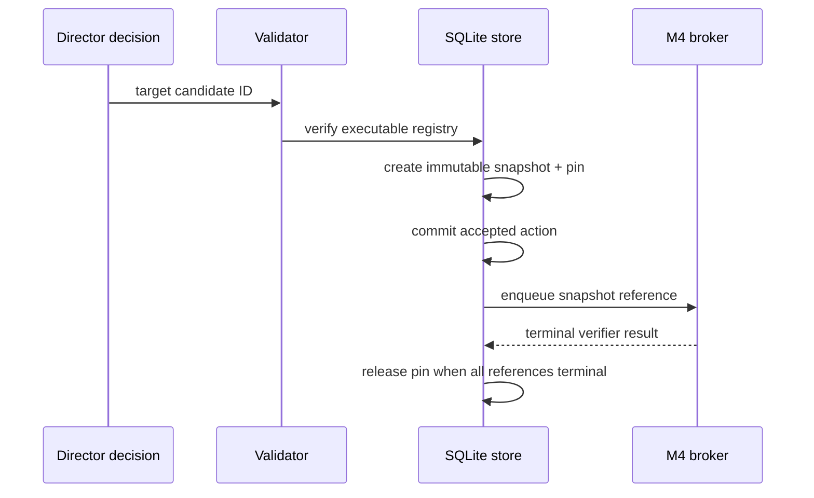

# Candidate Lifecycle

## Retention

Search lanes emit improvements. The archive retains a bounded set rather than
a rejected-candidate firehose.

A candidate stores:

- candidate ID;
- graph body or graph6 artifact;
- graph/artifact hash;
- score and score semantics;
- lane/checkpoint provenance;
- state and certification status;
- timestamps.

## Registries

The Director state separates:

- evidence IDs;
- advisory target IDs;
- executable target IDs.

Visibility does not imply executability.

## Accepted candidate-target action

## Pinning

`ON DELETE RESTRICT` and pruning filters prevent removal of referenced
candidates. M4 consumes the immutable snapshot, not a later lookup of a mutable
row.

## Stale target

If a target becomes stale before action acceptance:

- persist `stale_target`;
- execute nothing;
- refresh candidate and executable registries;
- allow one fresh stateless replan;
- do not fail the entire campaign on the first stale reference.

## Historical actions on Resume

Terminal actions are never re-executed. A historical action referencing a
missing candidate is converted to terminal stale evidence at authorized
Resume, not dispatched again.
