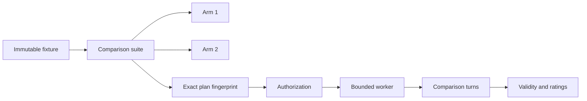

# Comparison System

## Purpose

The comparison subsystem measures model/effort/context behavior independently
from production research campaigns.

## Domain

## Fixtures

A fixture provides byte-identical:

- DirectorStateV2;
- prompt;
- output schema;
- registries;
- action space;
- base/developer instructions;
- budget/target metadata.

## Plans

The fingerprint binds:

- arm count/order;
- model/effort/context;
- repetitions;
- fixture hashes;
- limits;
- failure policy;
- resource accounting;
- measurement-only policy.

## Worker

The dashboard launches a fixed argv worker. It uses durable lease/heartbeat,
inference reservations, fail-closed lifecycle, and bounded private runtimes.

## Independent invalid policy

New independent arms may continue after schema-invalid or semantic-invalid
model output. Infrastructure/security/protocol/resource/model-contract failure
blocks later arms. Dependent persistent sequences require predecessor success.

## Ratings

The system supports:

- automatic validity;
- manual usefulness/clarity/novelty/would-execute ratings;
- blind pairwise preference;
- downstream scientific outcome references.

These are not collapsed into one opaque quality score.

## Cost

Separates authoritative token usage, relative subscription units, and optional
API-equivalent estimates.
