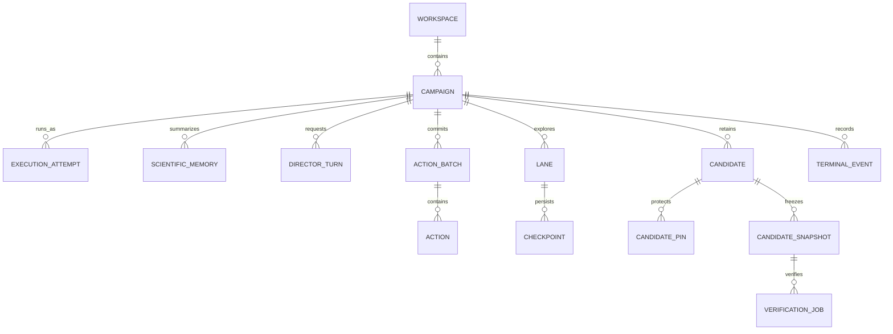

# Domain Model

## Main aggregates

## Workspace

Identity: filesystem path and workspace marker.

Owns:

- one authoritative SQLite database;
- campaigns and comparisons;
- safe scientific artifacts;
- runtime/export metadata.

## Campaign

Identity: stable `campaign_id`.

Immutable scientific contract includes:

- target and target-definition hash;
- Director model, effort, and context mode;
- scientific prompt/schema versions;
- initial state;
- stop and resource policy.

Mutable cumulative state includes:

- hypotheses;
- lanes and checkpoints;
- candidates;
- M4 outcomes;
- counters;
- scientific-memory snapshots;
- attempts and faults.

## Execution attempt

Identity: immutable `attempt_id` plus monotonic attempt index.

Records:

- reason;
- code commit;
- requested/effective resources;
- additional time;
- starting memory/checkpoints;
- inherited/local counters;
- process/auth provenance;
- terminal result.

## Director turn

Records:

- submitted state and registries;
- thread/turn/item IDs;
- expected/effective model contract;
- raw/normalized response;
- schema and semantic validation;
- usage and latency;
- repair lineage.

## Action batch and action

A batch is durably committed before dispatch. Actions have workspace-scoped
IDs and idempotency keys.

Non-idempotent ID collisions reject the batch before action or hypothesis
persistence. One fresh stateless repair may be attempted.

## Lane

A durable lane identity spans process generations. A lane has:

- graph family;
- algorithm/parameters;
- seed lineage;
- checkpoint lineage;
- version;
- resource share;
- state and terminal reason;
- telemetry windows.

## Candidate

A retained graph with score, provenance, graph body/artifact, state, and
certification status.

A targeted candidate may acquire pins and an immutable snapshot.

## Verification job

References an immutable candidate snapshot and executes bounded independent
verifier paths. Terminal outcome is not repeated.

## Scientific-memory snapshot

Immutable versioned projection with parent, high-water marks, canonical JSON,
byte size, token estimate, SHA-256, and trigger.

## Comparison suite

Separate measurement-only aggregate with immutable fixture, arms, exact plan
authorization, worker attempt, turns, usage, ratings, and cost profiles.
Returned decisions are not executed.
