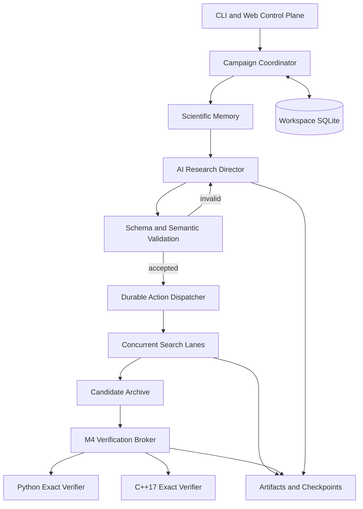

# System Overview

## Components

## Scientific control loop

1. Build bounded Director state from scientific memory and recent deltas.
2. Start a fresh stateless Director turn.
3. Validate structured output against exact submitted registries and action
   catalog.
4. Persist the decision and action batch.
5. Dispatch only accepted actions.
6. Search lanes execute bounded micro-batches and emit telemetry/checkpoints.
7. Promising candidates are retained.
8. M4 verifies candidates through independent paths.
9. Effects and verifier outcomes enter the next scientific state.
10. Stop on certified success, operator control, fault, or budget.

## Correctness boundaries

### Search

Search is heuristic, incomplete, and optimized for useful gradients.

### Verification

M4 is exact and independent. It is the only certification authority.

### Director

The Director chooses reviewed actions but has no direct code, shell, file, or
tool authority.

### Persistence

SQLite and artifacts form the durable state. Model conversation history is not
the source of truth.

## Campaign continuity

A campaign is stable across process restarts. Resume creates a new execution
attempt, restores from persisted checkpoints and scientific memory, and
retains cumulative scientific history.

## Workspace isolation

Each workspace is independent. Fresh campaigns are comparable when they start
from the same initial state and budget. Resume is continuation, not an
independent comparison.
