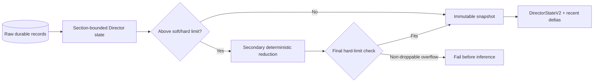

# Scientific Memory

## Purpose

Scientific memory bounds the state sent to a stateless Director while
preserving full raw history in SQLite and artifacts.

It is not Codex thread compaction.

## Default policy

| Setting | Default |
|---|---:|
| Soft trigger | 24,576 canonical UTF-8 bytes |
| Hard limit | 32,768 canonical UTF-8 bytes |
| Periodic snapshot | Every 5 valid scientific cycles |
| Boundary snapshots | Pause, stop, budget/deadline, fault, Resume |

## Snapshot contents

Non-droppable:

- exact-verifier facts;
- certified facts;
- current executable IDs;
- current hypothesis ledger;
- latest valid assessment;
- current useful checkpoints;
- unresolved scientific questions;
- current resources and restore results.

Bounded/aggregated:

- repetitive telemetry;
- equivalent parameter configurations;
- old non-record candidates;
- detailed per-evaluation traces;
- redundant ancestry;
- old operational events.

## Construction

The total 32,768-byte Director limit is enforced only after the secondary
reduction has had an opportunity to remove bounded historical detail.
Section-specific ancestry and outcome limits are applied before that reduction.
The final submitted state is then rebuilt from the reduced projection and
checked again before registries, prompt material, or inference are created.
Continuity ledgers remain fixed windows across snapshot merges: 32 latest
exact-verifier outcomes, 64 hypotheses, candidates, and lane/checkpoint
entries, and four validation-feedback entries. A merge fills missing entries
from the prior snapshot only within those bounds; it never regrows a window.
Model-facing completed verifier facts contain the candidate ID and exact
certification result; unknown/failed facts also retain their state. Lane
checkpoint facts use logical checkpoint IDs. Filesystem references, verifier
manifests, and checkpoint hashes remain in durable storage rather than being
repeated in every Director request.

## High-water marks

Snapshots record source high-water marks. The next turn uses:

- latest snapshot;
- bounded deltas after the high-water marks;
- live executable registries;
- current budget/resources.

This avoids replaying all prompts and events.

## Overflow

If non-droppable facts cannot fit below the hard limit, the runtime fails before
inference with `scientific_state_overflow`. It never silently drops exact facts
or sends an invalid truncated state.

A reducible pre-projection state is not an overflow. In particular, growth in
historical questions, explored regions, candidate detail, lane parameters, or
hypothesis prose must reach secondary reduction before the hard-limit decision.

## Resume

Terminal snapshots are natural Resume boundaries. A new execution attempt
records the starting memory ID and SHA-256.
