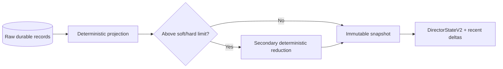

# Scientific Memory

## Purpose

Scientific memory bounds the state sent to a stateless Director while
preserving full raw history in SQLite and artifacts.

It is not Codex thread compaction.

## Default policy

| Setting | Default |
|---|---:|
| Soft trigger | 24,576 canonical UTF-8 bytes |
| Hard limit | 32,768 canonical UTF-8 bytes |
| Periodic snapshot | Every 5 valid scientific cycles |
| Boundary snapshots | Pause, stop, budget/deadline, fault, Resume |

## Snapshot contents

Non-droppable:

- exact-verifier facts;
- certified facts;
- current executable IDs;
- current hypothesis ledger;
- latest valid assessment;
- current useful checkpoints;
- unresolved scientific questions;
- current resources and restore results.

Bounded/aggregated:

- repetitive telemetry;
- equivalent parameter configurations;
- old non-record candidates;
- detailed per-evaluation traces;
- redundant ancestry;
- old operational events.

## Construction

## High-water marks

Snapshots record source high-water marks. The next turn uses:

- latest snapshot;
- bounded deltas after the high-water marks;
- live executable registries;
- current budget/resources.

This avoids replaying all prompts and events.

## Overflow

If non-droppable facts cannot fit below the hard limit, the runtime fails before
inference with `scientific_state_overflow`. It never silently drops exact facts
or sends an invalid truncated state.

## Resume

Terminal snapshots are natural Resume boundaries. A new execution attempt
records the starting memory ID and SHA-256.
