# HEG user screenshot review

This is the pre-publication review set for the markers in
`docs/user/screenshot-plan.md`. The markers have deliberately not been
replaced yet.

The campaign, observatory, lane, candidate, Resume, attempt-history, and fault
captures come from the real
`workspace/first-real-graph-campaign-01` workspace. Comparison captures use the
deterministic `workspace/docs-screenshots` UI fixture. The prepared/pre-start
captures use an isolated, non-authorized prepared workspace. No Director turn,
search process, authorization, Resume attempt, or exact verification was
started while capturing these images.

There are 17 actionable markers. The previously reported total of 18 counted
the literal `rg` example in the screenshot-plan page.

## Review status

| ID | Source | Review status | Important review note |
|---|---|---|---|
| `USR-HOME-01` | Real workspace | Ready | Current real state is `paused_fault`, with workspace and campaign summary visible. |
| `USR-CONCEPTS-01` | Real workspace | Ready | Shows the two newest immutable attempts and cumulative/current metrics. |
| `USR-QUICKSTART-01` | Isolated prepared workspace | Needs decision | The current dashboard does not render the immutable prepared-plan fingerprint and Director contract as a dedicated card; the capture shows the complete prepared dashboard instead. |
| `USR-QUICKSTART-02` | Isolated prepared workspace | Ready | Shows `prepared`, auth not imported, connection unavailable, stop condition, and disabled Start control. |
| `USR-QUICKSTART-03` | Real workspace | Needs decision | The only current real state is the fail-closed paused fault, not a running attempt. The capture preserves real status, memory/decision context, and the retained graph instead of simulating “running.” |
| `USR-WORKSPACE-01` | Real workspace | Ready | Workspace path is visible; the dashboard does not currently display an explicit non-synthetic badge. |
| `USR-CAMPAIGN-01` | Real workspace | Ready with caveat | Includes current assessment, two hypotheses, and the adjacent latest Director decision. Hypothesis cards do not expose a separate evidence field. |
| `USR-CAMPAIGN-02` | Real workspace | Ready with caveat | Three real lane cards are visible; the current cards do not expose checkpoint/fork/revision markers requested by the marker. |
| `USR-RESUME-01` | Real workspace | Ready | Read-only Resume preview; no process was started. |
| `USR-RESUME-02` | Real workspace | Needs decision | Shows two real Resume attempts, but both are fault-terminal rather than a successful Resume. |
| `USR-DASHBOARD-01` | Real workspace | Ready | Uses the best retained graph because it is the stable persisted source; the paused live frontier remains available in the real workspace. |
| `USR-DASHBOARD-02` | Real workspace | Ready | Exact 390×844 viewport, no page-wide horizontal overflow. |
| `USR-COMPARISON-01` | Deterministic fixture | Ready | Full two-arm creation form. |
| `USR-COMPARISON-02` | Deterministic fixture | Ready | Prepared plan and separate authorization controls. |
| `USR-COMPARISON-03` | Deterministic fixture | Ready | Blind semantic cards and rating controls; no model/token/latency/cost identity is shown. |
| `USR-VERIFY-01` | Real workspace | Ready with caveat | Shows a real invalid candidate, capped heuristic score, highlighted persisted exact M4 cycle-4 witness, and verification records. The current UI does not label the two verifier rows explicitly as “Python” and “C++.” |
| `USR-TROUBLE-01` | Real workspace | Ready | Exact `DirectorContextBudgetExceeded` fail-closed fault and Resume availability. |

## Dashboard and workspace

### USR-HOME-01 — dashboard overview

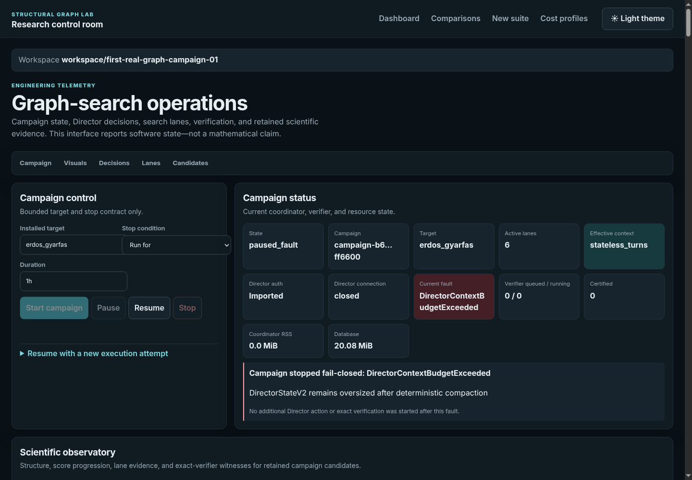

### USR-WORKSPACE-01 — workspace identity

### USR-DASHBOARD-01 — scientific observatory

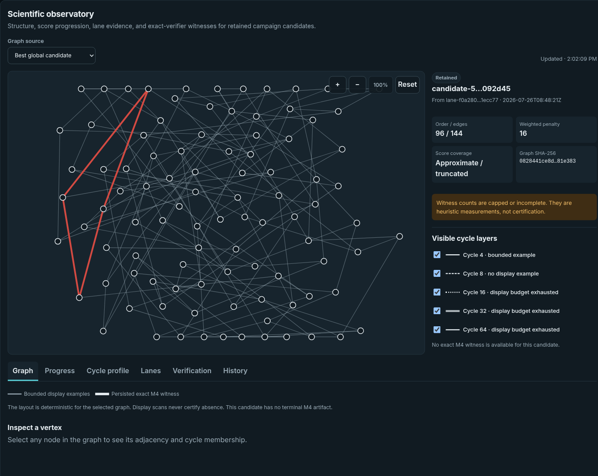

### USR-DASHBOARD-02 — mobile dashboard

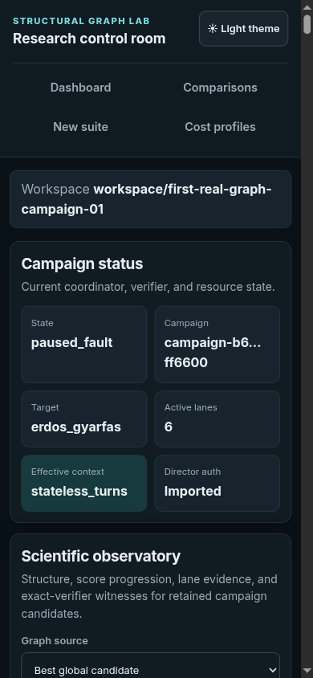

## Campaign, attempts, and Resume

### USR-CAMPAIGN-01 — Director assessment

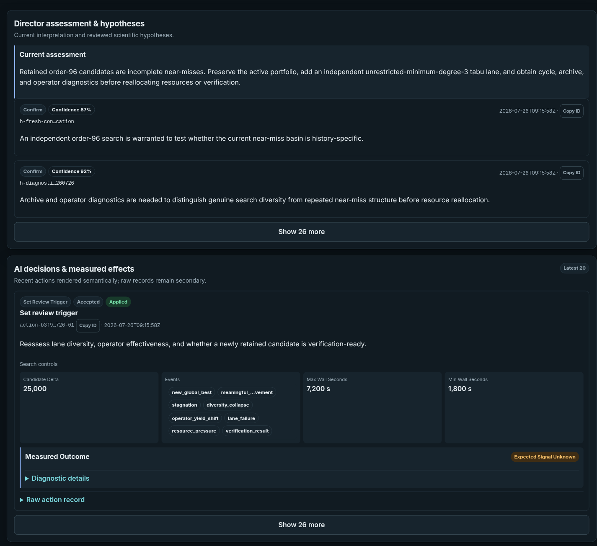

### USR-CAMPAIGN-02 — lane trajectories

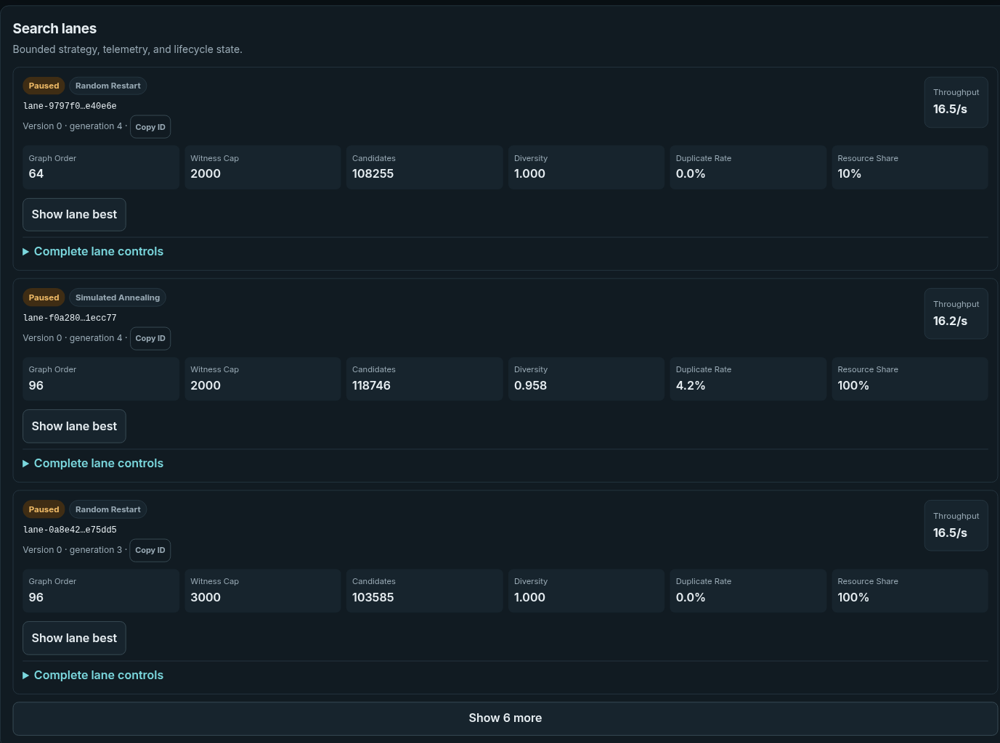

### USR-CONCEPTS-01 — campaign and attempt identity

### USR-RESUME-01 — Resume preview

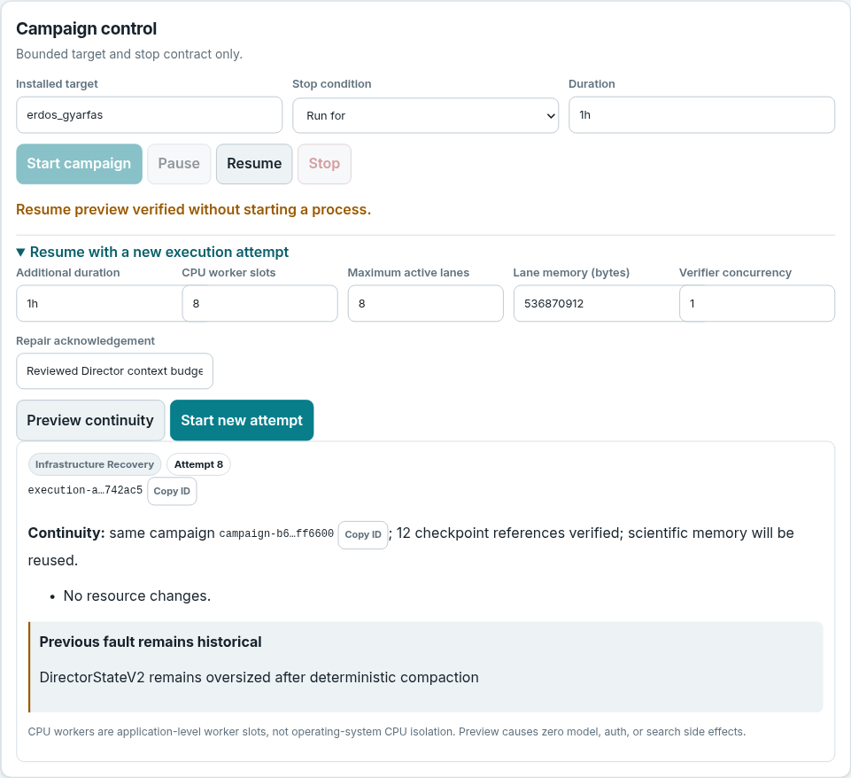

### USR-RESUME-02 — attempt history

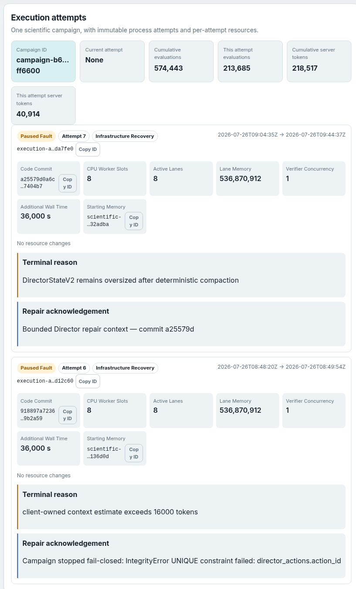

### USR-TROUBLE-01 — fail-closed fault

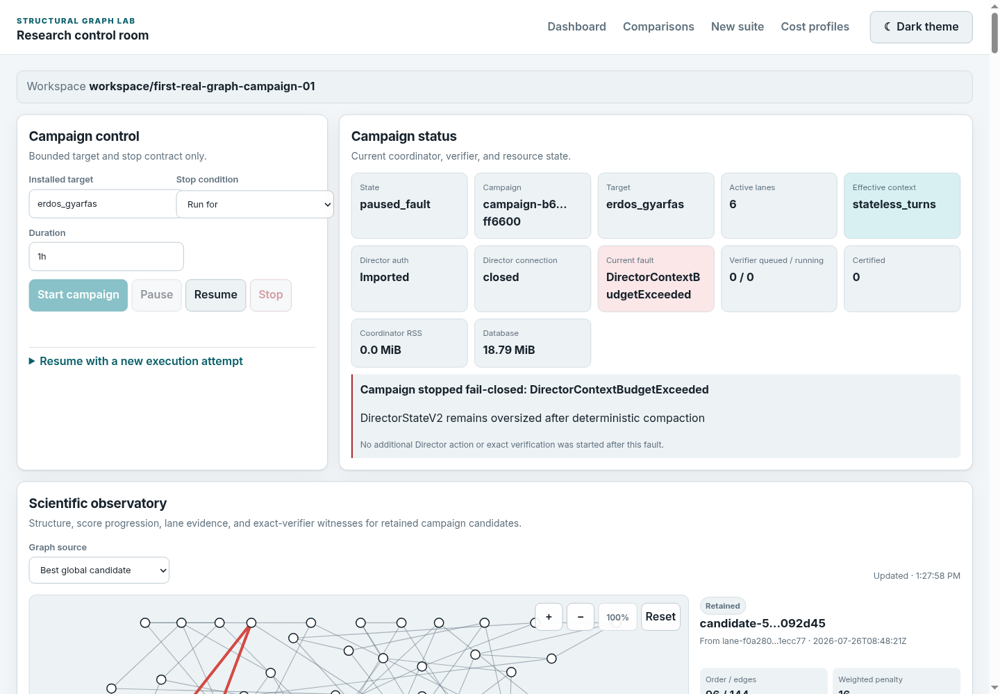

## Quickstart states

### USR-QUICKSTART-01 — prepared campaign

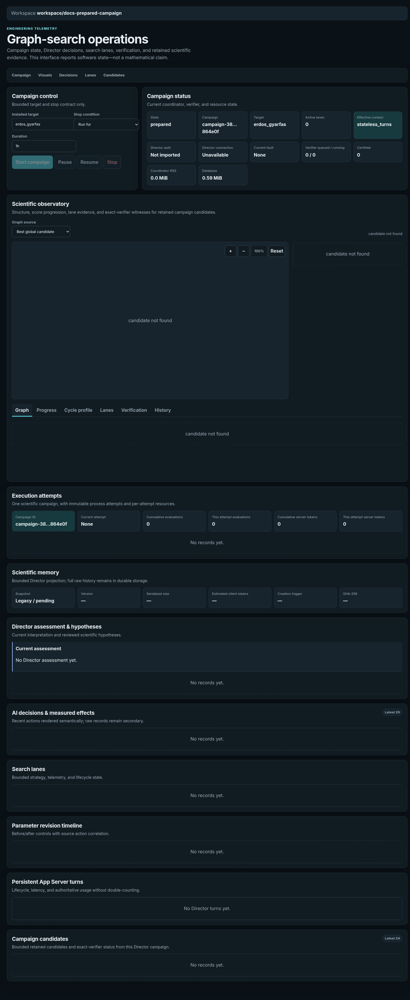

### USR-QUICKSTART-02 — pre-start controls

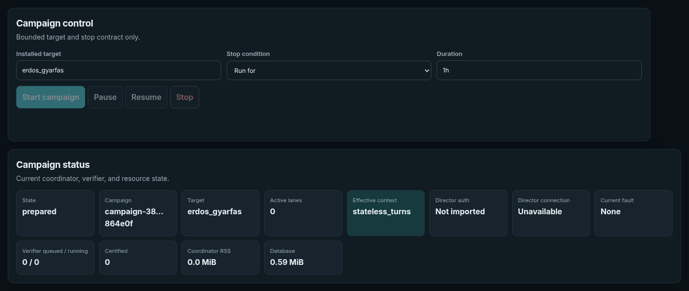

### USR-QUICKSTART-03 — current real campaign

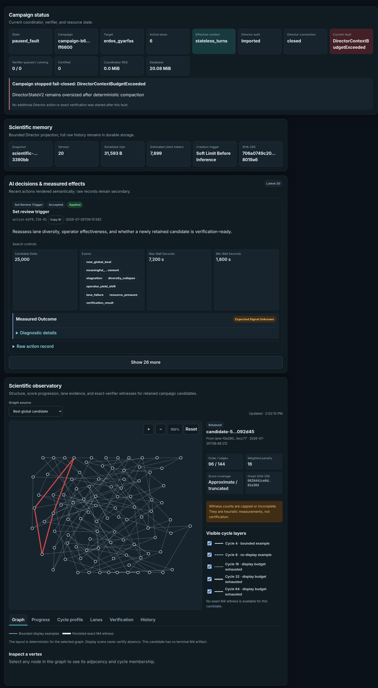

## Candidate verification

### USR-VERIFY-01 — rejected candidate and exact witness

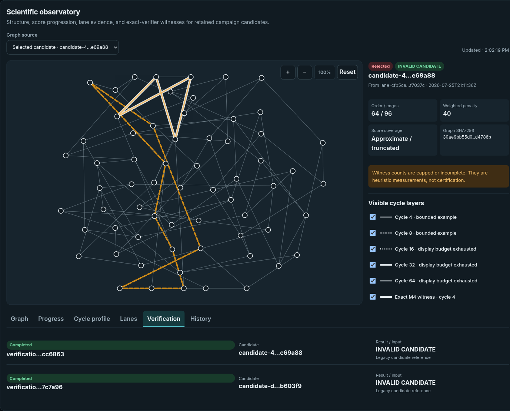

## Controlled comparisons

### USR-COMPARISON-01 — new suite

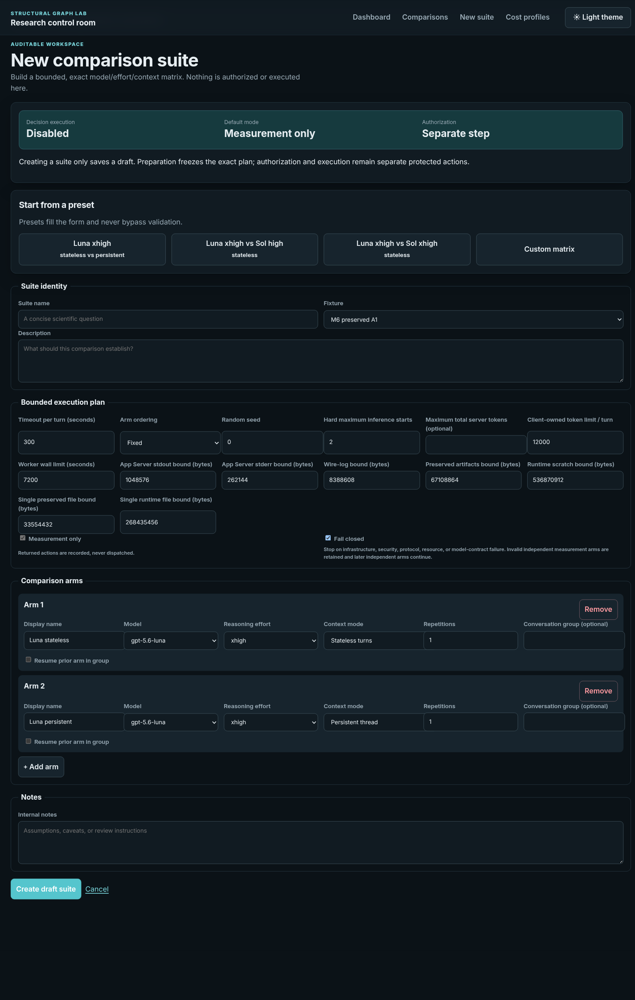

### USR-COMPARISON-02 — prepared plan

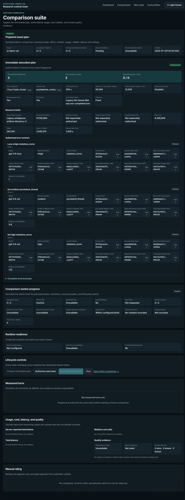

### USR-COMPARISON-03 — blind pair

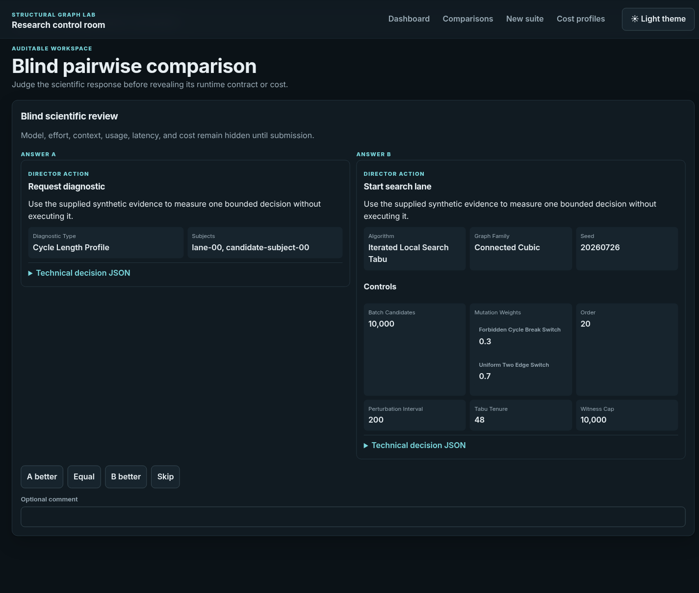
