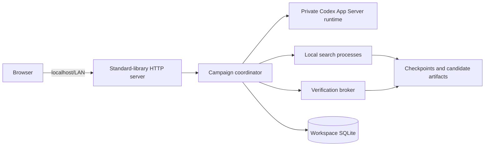

# Operator Guide

This guide covers deployment, authentication, resource limits, process
lifecycle, recovery, backup, and security.

## Normal deployment shape

## Operator responsibilities

- protect dashboard state-changing endpoints;
- authorize exact campaign/comparison fingerprints;
- keep auth material outside workspaces and Git;
- choose host-level memory/CPU controls when application limits are
  insufficient;
- use consistent SQLite backup/export procedures;
- inspect faults before Resume;
- preserve evidence reports and historical attempts.

## Start here

- [Deployment](deployment.md)
- [Authentication](authentication.md)
- [Resource limits](resource-limits.md)
- [Process lifecycle](process-lifecycle.md)
- [Recovery](recovery.md)
- [Backup and export](backup-and-export.md)
- [Security](security.md)
