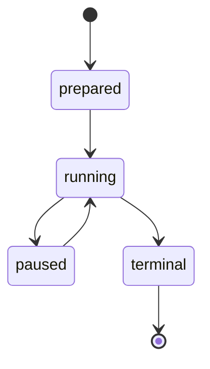

# Process Lifecycle

## Ownership

Each process must have one reviewed owner:

- campaign coordinator owns lane and verifier processes;
- each lane owns at most one persistent heuristic score-worker child;
- dashboard owns workers it launches;
- App Server client owns its process group;
- workspace lock prevents a second coordinator.

## Worker leases

Durable leases include:

- owner/worker ID;
- PID/process-group ID;
- host;
- acquired/heartbeat/expiry/release timestamps;
- terminal reason.

Lease acquisition is transactional. An expired lease is not automatically
treated as permission for paid Resume; the operator must inspect state.

## Child reaping

The dashboard keeps bounded `Popen` handles for workers it created and polls
only those handles. It does not use indiscriminate global `waitpid`.

A zombie PID is not considered a live worker.

## Stop flow

1. persist stop request;
2. worker observes request;
3. stop before next arm/batch or interrupt active turn;
4. drain late events;
5. persist terminal state;
6. close child processes;
7. release lease;
8. reap owned child.

A score-worker protocol error, timeout or crash gets one bounded restart. A
second failure closes the child and fails the lane. The helper never certifies
candidates and never converts failure into cycle absence.

## Campaign attempt lifecycle

A new Resume does not resurrect old processes. It creates a new execution
attempt and restores from persisted checkpoints/scientific memory.

## Crash behavior

- before inference: release unused reservation where allowed;
- after inference: inference remains consumed; no automatic retry;
- App Server crash: preserve known events, fail closed;
- worker crash: mark attempt, block later work;
- host restart: stale live state becomes recovery candidate, never silent paid
  Resume.

## Orphan checks

After tests or terminal shutdown, inspect:

- worker processes;
- App Server processes;
- lane/verifier children;
- active leases;
- listening dashboard ports.

Unrelated system processes must not be reaped.
