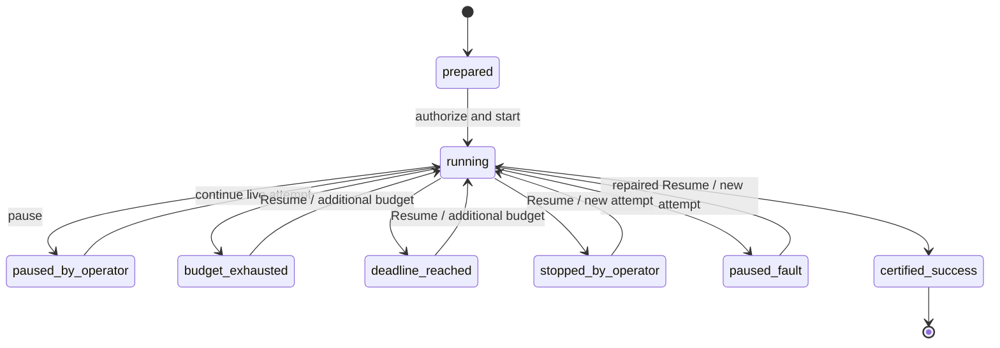

# Campaigns

A campaign is one durable scientific experiment.

## Campaign lifecycle

Exact state names may include additional terminal or recovery variants; see
[State Machines](../reference/state-machines.md).

## What the Director decides

The Director works through a reviewed action catalog. It may:

- start a lane;
- patch lane parameters;
- fork a lane from a checkpoint;
- restart or stop a lane;
- reallocate lane resources;
- promote a candidate;
- schedule exact verification;
- request diagnostics;
- set review triggers.

The operator does not normally choose algorithms or mutation parameters for
the Active Director campaign.

## Campaign budgets

A prepared campaign fingerprints:

- wall-time stop condition;
- maximum scientific cycles and Director turns;
- per-turn timeout;
- lane and aggregate resource limits;
- verification queue and timeout limits;
- App Server/log/resource limits;
- scientific-memory policy;
- replan policy.

## Director response policy

- Valid decisions are persisted, then dispatched.
- Invalid decisions are persisted and never dispatched.
- One fresh stateless repair turn may be allowed for the same scientific state.
- Repair prompts contain the same state, exact validation errors, and the
  invalid-response SHA-256—not a duplicated full rejected response.
- A second invalid repair stops cleanly.
- Infrastructure, protocol, resource, auth, and verifier failures remain
  fail-closed.

## Hypotheses

Hypothesis updates are operation-specific:

- `create` uses a new response-unique ID;
- `confirm`, `weaken`, `reject`, `retain`, and `revise` must reference an
  existing submitted hypothesis ID;
- evidence arrays contain exact submitted evidence-registry IDs, never prose.

## Campaign progress

Measure progress with:

- cumulative evaluations;
- score progression;
- explored graph families/orders/parameter regions;
- lane stagnation and diversity;
- retained candidates;
- exact-verifier outcomes;
- hypothesis changes;
- time and model usage.

Do not use only the final best score.

[screenshot: ID=USR-CAMPAIGN-01; save as docs/assets/screenshots/user/campaigns/director-assessment.png; crop the “Director assessment & hypotheses” section from a running or stopped campaign, include the latest campaign assessment, at least two hypothesis cards with confidence/evidence, and the adjacent current Director decision summary; exclude raw JSON technical details.]

[screenshot: ID=USR-CAMPAIGN-02; save as docs/assets/screenshots/user/campaigns/lane-trajectories.png; crop the live lane visualization or lane cards showing at least three lanes with distinct statuses or algorithms, checkpoint markers, and one fork/restart/parameter revision indicator; include the section heading and legend.]
