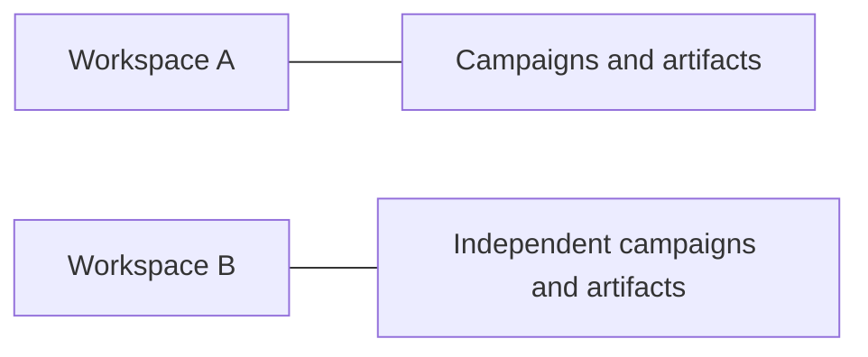
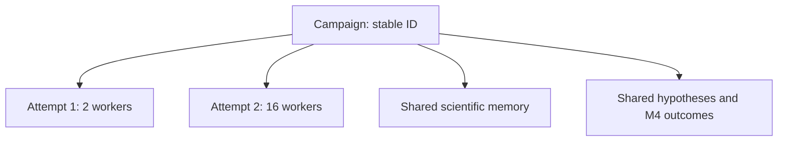

# Core Concepts

## Workspace

A workspace is an isolated research environment containing its own SQLite
database, artifacts, checkpoints, logs, comparisons, and exports.

A new workspace does not automatically see data from another workspace.

Use a new workspace when you want:

- a separate research project;
- a clean-room experiment;
- a copy prepared for model comparisons;
- isolation from existing runtime and scientific history.

## Campaign

A campaign is one scientific experiment with a stable campaign ID.

It contains:

- Director turns;
- hypotheses;
- search lanes;
- candidates;
- M4 verification jobs;
- cumulative metrics;
- scientific-memory snapshots;
- one or more execution attempts.

## Execution attempt

An execution attempt is one process-level start or Resume of a campaign.

Resume keeps the same campaign ID but creates a new attempt ID. This allows:

- bug-fix code between attempts;
- additional time;
- changed worker slots;
- changed active-lane or verifier resources;
- fresh App Server runtime and authorization provenance;
- preserved scientific continuity.

## Live continue versus Resume

- **Continue** unpauses a still-live execution attempt.
- **Resume** creates a new attempt after a terminal, interrupted, or repaired
  state.

## Scientific memory

Scientific memory is a bounded projection of durable facts sent to each fresh
stateless Director turn. It does not delete raw history and is not ordinary
conversation compaction.

Default policy:

- soft trigger: 24,576 bytes;
- hard limit: 32,768 bytes;
- periodic snapshot: every 5 valid scientific cycles;
- boundary snapshots: pause, stop, budget exhaustion, fault, and Resume.

## Lane

A lane is a long-lived graph-search process with:

- graph family and algorithm;
- deterministic seed lineage;
- mutable reviewed parameters;
- checkpoint history;
- telemetry and outcomes;
- bounded memory and queues.

The Director may start, patch, fork, restart, stop, or reallocate lanes.

## Candidate

A candidate is a retained graph considered scientifically notable. A candidate
targeted by an accepted action is pinned and frozen into an immutable snapshot
so it cannot disappear before verification.

## M4 verification

M4 is the certification boundary. It compares independent exact paths and
preserves their artifacts. M4 may:

- reject a candidate with an explicit forbidden-cycle witness;
- return unknown because of timeout, memory, malformed output, or disagreement;
- certify a counterexample only when the reviewed independent paths completely
  agree.

## Fresh campaign versus Resume

| Goal | Operation |
|---|---|
| Continue the same scientific experiment | Resume the campaign |
| Add more time or CPU worker slots | Resume the campaign |
| Recover after an infrastructure fault | Repair, acknowledge, then Resume |
| Change target, Director model, effort, context, or scientific prompt contract | Create a fresh campaign |
| Compare models from the same initial state | Create independent fresh campaigns or a comparison suite |
| Start with no previous knowledge | Create a fresh workspace/campaign |

[screenshot: ID=USR-CONCEPTS-01; save as docs/assets/screenshots/user/campaigns/campaign-attempt-identity.png; on a campaign dashboard with at least two attempts, crop the section that shows the stable campaign ID, the execution-attempt list, and cumulative versus current-attempt metrics; include headings and full attempt rows, exclude unrelated lane and candidate sections.]
